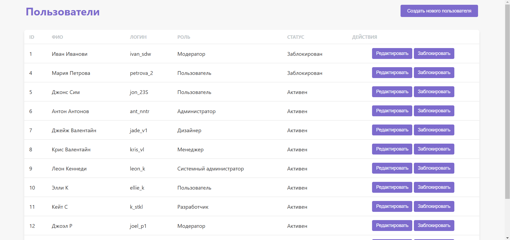

# Справочник пользователей

Проект представляет собой веб-приложение для управления пользователями. Он включает в себя функциональность для отображения списка пользователей, их редактирования и блокировки. Все действия выполняются через модальные окна с подтверждениями.

## Основные особенности:
- **Просмотр пользователей**: Получение списка всех пользователей с возможностью редактировать их информацию и блокировать.
- **Редактирование пользователя**: Возможность редактировать ФИО, логин и роль пользователя.
- **Блокировка пользователя**: Возможность заблокировать пользователя с указанием причины и времени блокировки.
- **Использование модальных окон**: Все действия редактирования и блокировки пользователей выполняются в модальных окнах.

## Структура проекта
- **Frontend**: HTML, CSS и JavaScript для взаимодействия с сервером.
- **Backend**: PHP сервер с использованием MySQL для хранения данных пользователей.

![Скриншот интерфейса]

  

